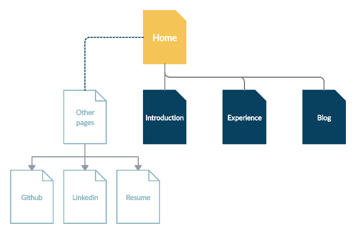
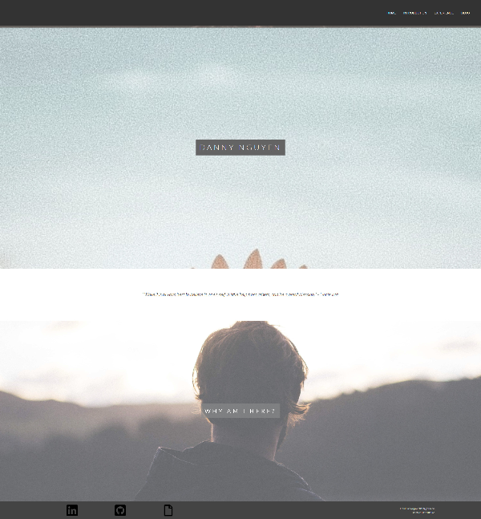
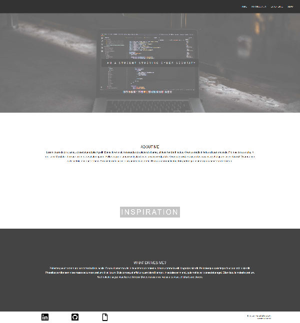
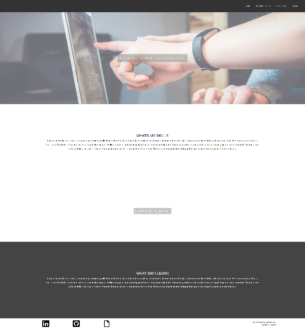
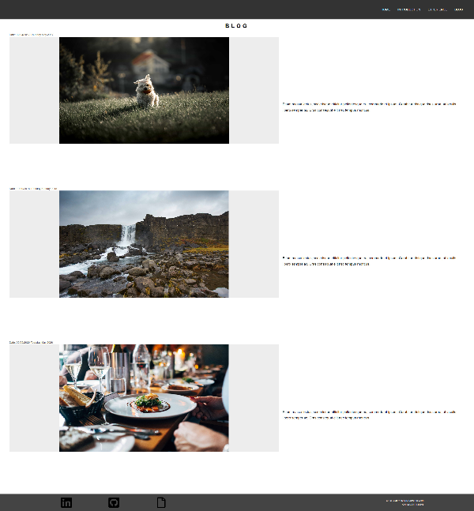

# Danny's Portfolio

## Links:
\
**github**: https://github.com/csm012001
\
\
**Website**: https://test.com/index.html
## Purpose
\
This portfolio purpose is to attract, aspire and demostrate my knowledge of interest and ability of programming towards employers whom is looking for a **Dev** and/or **IT professional**. 
The use of this portfolio website will not only serve to advertise me through interest and experience but will serve as a chance to learn html and css in order to build one. 
## Functionality / Features
* Navigation Bar, goes to 4 different pages (home, introduction, experience, blog)
* Parallax scrolling, when scrolling, images will stay fix when website content while continue moving, giving it a layering effect.
* Icons located at the footer will direct you to there corresponding page.

## Sitemap

## Screenshots
### Home

### Introduction

### Experience

### Blog

## Target Audience
For this portfolio, it is aiming to attract mostly employers who is searching to hire Dev and/or IT professional, though there are others employers that does not need that such as IT Help Desk, Dev assistant and much more.

## Tech Stack
Ed workspace, Html (Hyper text markup lanuage) and css (cascading styling sheet)

